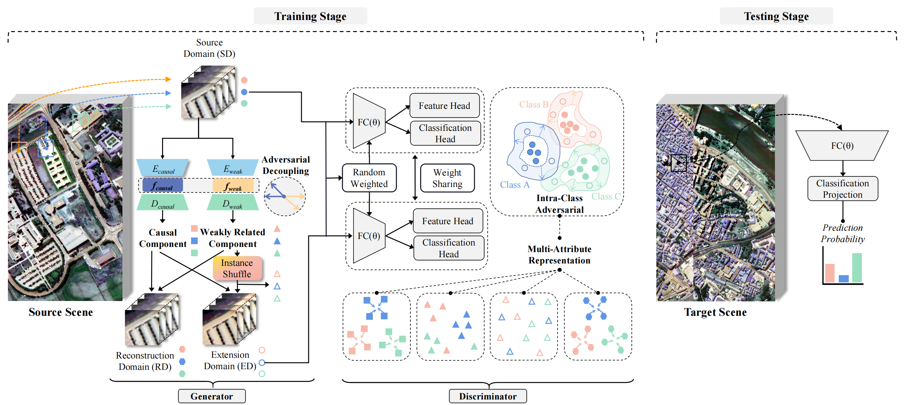

# Adversarial Decoupling Domain Generalization Network for Cross-scene Hyperspectral Image Classification

<p align='center'>
  
</p>

## Abstract

Cross-scene hyperspectral image classification tasks have widely applied domain adaptation (DA) methods. However, DA typically adapts to the specific target scene during training and requires retraining for new scenes. In contrast, recent domain generalization (DG) methods aim to transfer directly to unseen domains, eliminating the requirement for target data during training. Popular DG methods achieve reliable generalization performance by expanding the source distribution. However, since hyperspectral images contain implicit non-causal components, such as label-independent environmental features, the extended samples generated by the source inevitably introduce undesirable inductive biases, which cause the learning of spurious correlations. To address these issues, we design a novel DG network with adversarial decoupling and unbiased semantic extension. Specifically, we first develop a homogeneous dual-branch encoder based on latent adversarial disentanglement, which helps to separate label-dependent causal components and weakly related components and is also applied to simulate domain gaps. Secondly, to decrease the preference of generated samples on category-irrelevant components, we adopt domain-specific instance shuffling to synthesize extension domains so that the new domain can preserve intrinsic causal information while expanding semantic coverage. Furthermore, to augment domain-invariant features to combat spurious correlations, we propose a multi-attribute representation strategy that learns diverse heterogeneous features through inter-domain unsupervised reconstruction and intra-domain supervised aggregation. Extensive experiments were conducted on four datasets, the ablation study shows the effectiveness of the proposed modules, and the comparative analysis with the advanced DG algorithms shows our superiority in the face of various spectral and category shifts.

## Paper

Please cite our paper if you find the code or dataset useful for your research.

```
@ARTICLE

```


## Requirements

CUDA Version: 11.7

torch: 2.0.0

Python: 3.10

## Dataset

The dataset directory should look like this:

```bash
datasets
├── Houston
│   ├── Houston13.mat
│   ├── Houston13_7gt.mat
│   ├── Houston18.mat
│   └── Houston18_7gt.mat
└── Pavia
│   ├── paviaC.mat
│   └── paviaC_7gt.mat
│   ├── paviaU.mat
│   └── paviaU_7gt.mat
└── HyRANK
    ├── Dioni.mat
    └── Dioni_gt_out68.mat
    ├── Loukia.mat
    └── Loukia_gt_out68.mat

```

## Usage

1.You can download [Houston; Pavia; HyRANK](https://drive.google.com/drive/folders/1No-DNDT9P1HKsM9QKKJJzat8A1ZhVmmz?usp=sharing) dataset here.

2.You can change the `source_name` and `target_name` in train.py to set different transfer tasks.

3.Run the following command:

Houston dataset:
```
python train.py --data_path ./datasets/Houston/ --source_name Houston13 --target_name Houston18 --re_ratio 5 --max_epoch 200 --log_interval 20 --dim 512 --lambda_1 1 --lambda_2 1 --training_sample_ratio 0.8 --dim1 128 --dim2 128 --flip_augmentation --radiation_augmentation --seed 888
```
Pavia dataset:
```
python train.py --data_path ./datasets/Pavia/ --source_name paviaU --target_name paviaC --re_ratio 1 --max_epoch 50 --log_interval 5 --dim 512  --lambda_1 1 --lambda_2 1 --dim1 128 --dim2 128 --training_sample_ratio 0.8 --seed 1
```
HyRANK dataset:
```
python train.py --data_path ./datasets/HyRANK/ --source_name Dioni --target_name Loukia --re_ratio 1 --max_epoch 50 --log_interval 5 --dim 512 --dim1 128 --dim2 128 --training_sample_ratio 0.8 --seed 1
```


