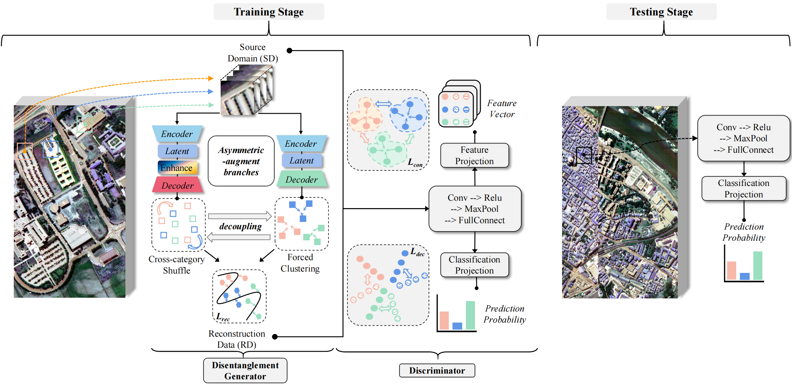

# Asymmetric Disentanglement and Non-discrimination Joint Learning Network for Cross-Scene Hyperspectral Image Classification

<p align='center'>
  
</p>

## Abstract

	Domain generalization (DG) methods exhibit considerable promise for cross-scene hyperspectral image (HSI) classification tasks, facilitating knowledge transfer from the source domain (SD) to the unknown target domain (TD). Mainstream DG methods prioritize achieving cross-domain invariance and ignoring the underutilized potential of domain-specific information. This study introduces the information gap theory for domain-invariant features, emphasizing the importance of domain-specific information in mitigating DG target risk. Based on the above insights, this study proposes a disentangled-inspired DG network to capture the underlying feature distributions of HSI and valuable domain-specific information. Components that are mutually independent are obtained from SD through intrinsic and variation generators, which align with invariance and domain-specific attributes, respectively. The generator utilizes asymmetric-augmentation to implement an independence constraint while perturbing potentially spurious-correlated neurons to reduce the risk of learning spurious patterns. To mitigate the overestimation of invalid information and the underestimation of valid information, the decoupled components are reconstructed through selective filtering using gated synthesis. Furthermore, contrast decoupling learning addresses the trade-off between domain reconstruction and expansion capabilities. Extensive experiments were conducted across three datasets, emphasizing performance comparison, ablation studies, and detailed analysis. The results indicate the efficacy and superiority of the proposed method in cross-scene classification tasks.

## Paper

Please cite our paper if you find the code or dataset useful for your research.

```
@ARTICLE

```


## Requirements

CUDA Version: 11.7

torch: 2.0.0

Python: 3.10

## Dataset

The dataset directory should look like this:

```bash
datasets
├── Houston
│   ├── Houston13.mat
│   ├── Houston13_7gt.mat
│   ├── Houston18.mat
│   └── Houston18_7gt.mat
└── Pavia
│   ├── paviaC.mat
│   └── paviaC_7gt.mat
│   ├── paviaU.mat
│   └── paviaU_7gt.mat
└── HyRANK
    ├── Dioni.mat
    └── Dioni_gt_out68.mat
    ├── Loukia.mat
    └── Loukia_gt_out68.mat

```

## Usage

1.You can download [Houston; Pavia; HyRANK](https://drive.google.com/drive/folders/1No-DNDT9P1HKsM9QKKJJzat8A1ZhVmmz?usp=sharing) dataset here.

2.You can change the `source_name` and `target_name` in train.py to set different transfer tasks.

3.Run the following command:

Houston dataset:
```
python train.py --data_path ./datasets/Houston/ --source_name Houston13 --target_name Houston18 --re_ratio 5 --max_epoch 200 --log_interval 20 --dim 512 --lambda_1 1 --lambda_2 1 --training_sample_ratio 0.8 --dim1 128 --dim2 128 --flip_augmentation --radiation_augmentation --seed 233
```
Pavia dataset:
```
python train.py --data_path ./datasets/Pavia/ --source_name paviaU --target_name paviaC --re_ratio 1 --max_epoch 50 --log_interval 5 --dim 512  --lambda_1 1 --lambda_2 1 --dim1 128 --dim2 128 --training_sample_ratio 0.8 --seed 233
```
HyRANK dataset:
```
python train.py --data_path ./datasets/HyRANK/ --source_name Dioni --target_name Loukia --re_ratio 1 --max_epoch 50 --log_interval 5 --dim 512 --dim1 128 --dim2 128 --training_sample_ratio 0.8 --seed 233
```


